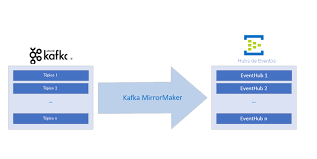
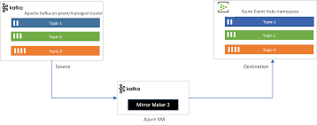

# Apache Kafka MirrorMaker

O **Apache Kafka MirrorMaker** é uma ferramenta utilizada para replicar dados entre diferentes clusters Kafka. Essa replicação é útil em diversos cenários, como:

- **Alta disponibilidade (Disaster Recovery):** Replicar dados de um cluster primário para um secundário para continuidade de negócios em caso de falhas.
- **Migração de clusters:** Transferir dados entre clusters durante uma atualização ou migração.
- **Sincronização entre datacenters:** Manter clusters Kafka em diferentes regiões sincronizados.

O MirrorMaker está disponível em duas versões principais: **MirrorMaker 1** (MM1) e **MirrorMaker 2** (MM2). Cada versão possui suas próprias características e aplicações. Abaixo, explicamos as diferenças entre elas.

---

## **MirrorMaker 1 (MM1)**

O MirrorMaker 1 é baseado no modelo de consumidor e produtor do Kafka. Ele utiliza um consumidor para ler mensagens de um cluster de origem e um produtor para escrevê-las no cluster de destino.

- **Vantagens:**
    - Configuração simples.
    - Bom para casos de replicacão básica Kafka-Kafka.
- **Limitações:**
    - Não suporta tradução de offsets.
    - Configuração manual para cada tópico replicado.
    - Não possui sincronização automática de tópicos.

- **Documentação Oficial:** [Apache Kafka MirrorMaker 1](https://kafka.apache.org/documentation/#georeplication)

---

## **MirrorMaker 2 (MM2)**

O MirrorMaker 2, introduzido no Kafka 2.4, é baseado no framework **Kafka Connect**. Ele traz avanços significativos em termos de facilidade de uso, escalabilidade e recursos avançados.

- **Vantagens:**
    - Tradução automática de offsets entre clusters.
    - Sincronização automática de tópicos e configurações.
    - Melhor suporte para monitoramento e gerenciamento em escala.
    - Baseado em Kafka Connect, permitindo expansão para integrações mais complexas.
- **Limitações:**
    - Requer mais configurações iniciais do que o MirrorMaker 1.

- **Documentação Oficial:** [Apache Kafka MirrorMaker 2](https://kafka.apache.org/documentation/#mirrormaker-2)

---

## **Tabela Comparativa: MirrorMaker 1 vs MirrorMaker 2**

| **Aspecto**                 | **MirrorMaker 1 (MM1)**                  | **MirrorMaker 2 (MM2)**                  |
|-----------------------------|-------------------------------------------|-------------------------------------------|
| **Arquitetura**             | Consumidor e produtor Kafka              | Baseado em Kafka Connect                 |
| **Sincronização Automática** | Não suportado                          | Suportado                                |
| **Tradução de Offsets**     | Não suportado                          | Suportado                                |
| **Facilidade de Configuração** | Simples, mas manual                     | Requer mais configuração inicial        |
| **Escalabilidade**          | Limitada                                | Alta, com suporte nativo a clusters      |
| **Monitoramento**           | Limitado                                | Integrado com Kafka Connect              |
| **Casos de Uso**            | Replicacão básica Kafka-Kafka            | Replicacão avançada com sincronização e offsets |

---

## **Cases de implementação**

O MirrorMaker é uma ferramenta essencial para sincronização e replicacão em ambientes distribuídos Kafka. O MirrorMaker 1 é adequado para casos simples e menos exigentes, enquanto o MirrorMaker 2 é mais poderoso, suportando funcionalidades avançadas como sincronização automática e tradução de offsets.
Detalhe de implementação com docker-composer de ambas as versões:
[mm1](mm1)
[mm2](mm2)

Referencias:
https://santannaf.medium.com/usando-schema-registry-com-kafka-e-spring-boot-3-2-4-4c00181fcd22
https://learn.microsoft.com/pt-br/azure/event-hubs/event-hubs-kafka-mirror-maker-tutorial_
https://docs.kafka-ui.provectus.io/configuration/configuration-wizard
https://medium.com/dev-cave/mirroring-entre-datacenters-com-mirrormaker-parte-ii-55b37954de74