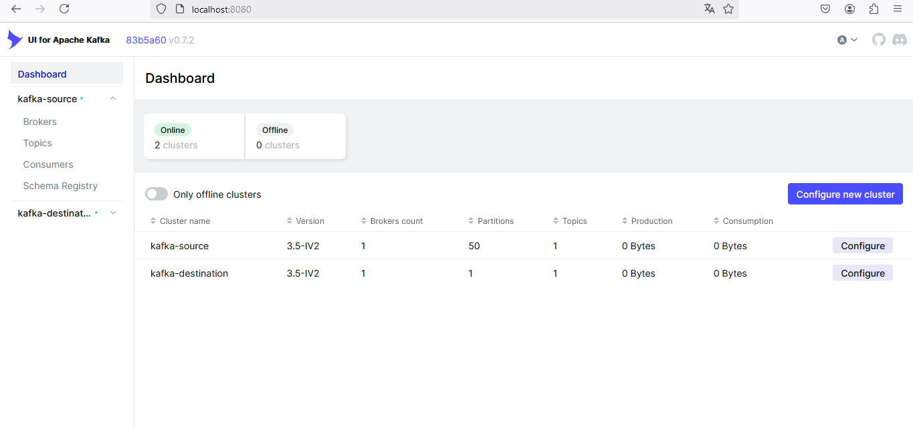
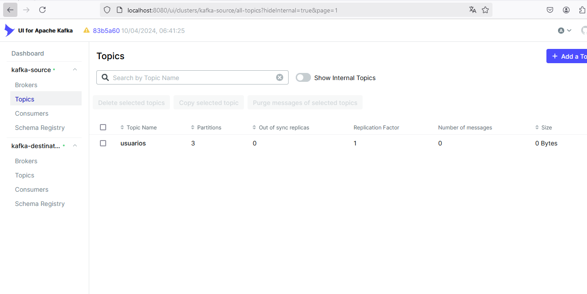
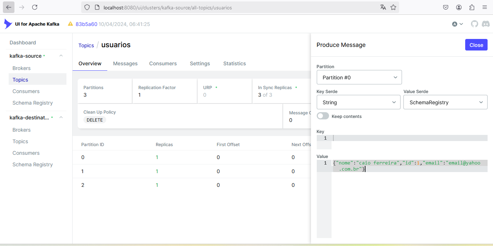
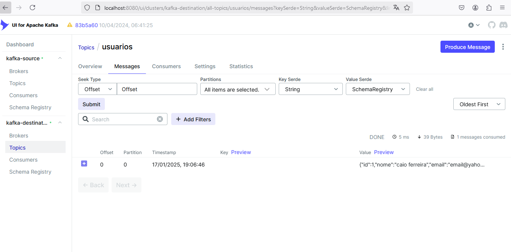

# MirrorMaker 1 - Projeto com Docker Compose

Este projeto demonstra o uso do **MirrorMaker versão 1** para replicação de mensagens entre dois clusters Kafka.

## **Requisitos para Execução**
- Docker **20.0** ou superior
- Docker Compose instalado

### **Iniciando o Projeto**
Execute o comando abaixo para subir os serviços:

```sh
docker-compose -f docker-compose.yaml up -d --build
```

---

## **O Que Este Projeto Cria**
- **1 Broker Kafka (source)**: Cluster de origem para produção de mensagens.
- **1 Broker Kafka (destination)**: Cluster de destino para replicação das mensagens.
- **1 MirrorMaker 1**: Conectado aos brokers de origem e destino para replicação.
- **1 Schema Registry Centralizado**: Gerencia os esquemas Avro.
- **1 Kafka UI**: Interface gráfica para gerenciamento dos tópicos e clusters Kafka.
- **1 Script Automatizado**:
    - Cria o tópico chamado `usuarios` no cluster de origem.
    - Registra o esquema Avro correspondente no Schema Registry.

---

## **Limitações do MirrorMaker 1**
O MirrorMaker versão 1 possui algumas limitações importantes:
- **Monitoramento de Tópicos**:
    - Não monitora dinamicamente tópicos criados após a inicialização.
- **Sincronização do Schema Registry**:
    - Não realiza sincronismo automático entre os schemas do Schema Registry de origem e destino.
- **Outras Limitações**:
    - Não possui suporte para transformações de mensagens.
    - Não suporta monitoramento avançado ou configurações dinâmicas.

---

## **Interface Visual (Kafka UI)**
Acesse a interface visual do Kafka UI para gerenciar tópicos e clusters:
- URL: [http://localhost:8080/](http://localhost:8080/)


---

## **Testando a Replicação**

### 1. **Criando um Tópico e Publicando Mensagem**
Acesse o broker de origem e publique uma mensagem no tópico criado (`usuarios`).

Após alguns instantes, o MirrorMaker replicará automaticamente o tópico e as mensagens para o broker de destino.

### 2. **Listando o Tópico Criado**
Você pode listar os tópicos no broker de destino:



### 3. **Publicando Mensagens no Tópico**
Publique mensagens no broker de origem. Elas serão replicadas automaticamente para o destino.



### 4. **Verificando Mensagens no Destino**
Acesse o broker de destino para listar os tópicos replicados e as mensagens.


---

## **Configurações do MirrorMaker 1**
O MirrorMaker 1 pode ser configurado de várias maneiras. Consulte a [documentação oficial](https://kafka.apache.org/documentation/#tools).

